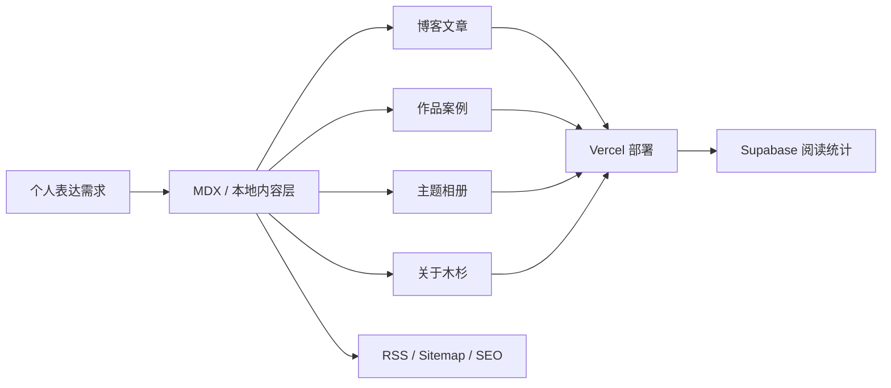

## 项目背景

我想要的不是传统意义上的“博客模板”，而是一个更完整的个人表达载体。它既要能认真承载文章，又需要有作品集、相册和关于页这样的展示空间。

这篇案例文档也顺手承担了一个额外任务：把站点里的 Markdown 与 MDX 能力尽量展示完整。你会在这里看到 **强调**、*斜体*、***强调斜体***、~~删除线~~、`inline code`、<mark>重点高亮</mark>、<abbr title="Static Site Generation">SSG</abbr>、<kbd>Cmd</kbd> + <kbd>K</kbd>、脚注[^engine-note]、引用式链接 [Next.js 文档][next-docs] 和自动链接 `https://nextjs.org/docs`。

## 设计目标

这个项目一开始就有几个明确方向：

1. 内容优先，首页要像一个温和的入口，而不是夸张的品牌海报。
2. 页面静态生成，保证性能、可维护性和 SEO。
3. 视觉上保持清新、简洁，并在局部加入毛玻璃与液态动效。

### 结构化拆分

1. 内容层：文章、作品集、友链、站点配置都本地维护。
2. 展示层：页面尽量做成“内容优先，而不是品牌海报优先”。
3. 派生层：`RSS`、`sitemap`、`JSON-LD`、分类与标签聚合都从内容层自动推导。

- 内容优先意味着首页要像入口。
- 作品页要能讲清楚背景、过程和结果。
- 相册和关于页则承担更感性的部分。

> 这类个人站点的核心不是“功能表做满”，而是让写作、展示和迭代变得顺手。
>
> - 写文章时不用担心结构松散
> - 增加新栏目时不用推倒重来
> - 部署时保持静态站的简单性

## 信息架构图



## 技术实现

内容系统采用本地 MDX，并通过 Zod 做 frontmatter 校验。文章、作品和配置的结构都足够明确，所以 RSS、sitemap、分类标签页和元信息生成都能顺着内容层自动完成。

访问量采用 Supabase 作为轻量存储，只把统计能力放进一个极小的接口层里，保持页面本身仍然是静态生成。

### 模块清单表

| 模块 | 作用 | 当前状态 | 优先级 |
| :-- | :-- | :--: | --: |
| `content/posts` | 文章内容源 | 已完成 | 1 |
| `content/portfolio` | 案例文档与项目说明 | 已完成 | 1 |
| `content/gallery` / 数据文件 | 相册与图片信息 | 进行中 | 2 |
| `src/lib/seo.ts` | metadata、JSON-LD、RSS、sitemap | 已完成 | 1 |
| `src/app/api/view` | 阅读数统计接口 | 已完成 | 2 |
| “关于木杉” 3D 形象 | 个人展示与视差叙事 | 持续迭代 | 3 |

### 任务清单

- [x] 文章系统
- [x] 分类与标签
- [x] RSS / sitemap / robots
- [x] 作品集案例页
- [x] 相册与友链
- [x] 阅读数统计
- [ ] 关于页真实人物素材替换
- [ ] 作品案例继续补充真实项目

### 代码示例

```tsx
type Post = {
  title: string;
  slug: string;
  summary: string;
  publishedAt: string;
  tags: string[];
};

export function pickFeaturedPosts(posts: Post[]) {
  return posts
    .filter((post) => post.tags.includes("nextjs") || post.tags.includes("设计"))
    .slice(0, 3);
}
```

```json
{
  "site": "木杉的风与代码",
  "features": ["blog", "portfolio", "gallery", "rss", "view-counter"],
  "contentSource": "local-mdx",
  "deployment": "vercel"
}
```

```bash
npm run dev
npm run lint
npm run typecheck
npm run build
```

### 可折叠说明

<details>
  <summary>为什么我会坚持用本地 MDX 而不是在线 CMS？</summary>
  <div>
    因为这类个人站点最重要的是可控性和长期维护成本。本地内容更适合版本管理，也更容易把
    RSS、SEO、分类标签和自定义页面一起纳入同一套内容结构。
  </div>
</details>

### 定义说明

<dl>
  <div>
    <dt>内容优先</dt>
    <dd>先保证文章、案例和图片的组织方式稳定，再决定首页如何包装它们。</dd>
  </div>
  <div>
    <dt>静态优先</dt>
    <dd>内容页尽可能静态生成，只把阅读数这类很小的能力放进动态接口。</dd>
  </div>
  <div>
    <dt>视觉克制</dt>
    <dd>保留留白、空气感和局部动效，而不是依赖大面积夸张装饰。</dd>
  </div>
</dl>

#### 小节层级演示

##### 五级标题也能正常显示

这里主要是为了验证标题层级、段落节奏、锚点滚动和长文档的阅读表现是否稳定。

<figure>
  
  <figcaption>案例文档里的图片、图注与卡片风格也保持和站点整体一致。</figcaption>
</figure>

---

## 结果

这个项目最重要的成果不是“功能做全了”，而是建立了一套可以长期扩展的个人站点骨架。接下来无论是继续写作、增加作品案例，还是替换真实个人素材，都不需要再动结构。

如果把这篇文档当作一份能力清单来看，它也说明了这套内容层现在已经能承载：

1. 长文叙事
2. 表格信息
3. 任务清单
4. 图片与图注
5. Mermaid 图表
6. 代码高亮与复制
7. 脚注、链接与 HTML 混排

[^engine-note]: 这类“案例文档既是内容又是功能验收页”的方式，对个人站点特别实用。

[next-docs]: https://nextjs.org/docs
